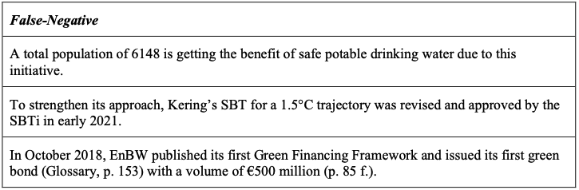

# Text-Classification-with-BERT

This Project is based on data and research created and done by Stammbach et al. (2023) in light of the Paper "Environmental claim Detection". 

This project aims to investigate how the number of environmental claims in the annual reports of DAX companies correlate with their actual environmental performance. For pursuing this goal, Logistic Regression and the BERT model are implemented to precisely recognizes environmental claims and compared. Subsequently, all sentences are extracted from the corresponding annual reports and categorized by the superior performing model (BERT). The advanced application for this model is set up to assess if there is a correlation between the number of environmental claims in their annual report and their actual sustainability rating. 

## Exploratory Data Analysis (EDA)
The data consisting of environmental and non-environmental claims, is not balanced. When trained with such a dataset, most machine learning algorithms tend to favor majority classes, hence resulting in a deficient performance for minority labels. Therefore, the dataset was modified to make it more balanced by manually adding instances to the minority class of environmental claims. This was done to a limited extent since it needed to be done with manual effort. By considering annual reports of major public corporations, more claims were added. Comparing the word count of the original sentences with the preprocessed word list, one can derive the rate of stop words in the text, since they are removed in the preprocessing. This analysis yields that with a rate of 44%, non-environmental claims have more stop words than environmental claims (37%). 

  
   
  Balanced Dataset

## Modeling

Two different approaches were used. First, a Logistic Regression was trained as a baseline model. Secondly, the deep learning model BERT was fine-tuned and applied to real-life data.

### Logistic Regression
To establish a benchmark and evaluate the complexity of the task we built a Logistic Regression Model. Logistic Regressions are a well-established statistical approach used for binary classification. This allows to predict the likelihood of an event by fitting the instances to a logistic curve.
The results show a high tendency of overfitting in the sense that Class 1 achieve constantly worse results than class 0 due to the underrepresentation in the train dataset.

| Class   | Precision | Recall | F1-Score | Support |
|---------|-----------|--------|----------|---------|
| Class 0 | 0.90      | 0.91   | 0.90     | 397     |
| Class 1 | 0.73      | 0.71   | 0.72     | 133     |

Table 2: Evaluation Metrices

## Bert
To add a layer of complexity, the Bidirectional Encoder Representations from Transformers (BERT) model was implemented as a deep learning approach for binary text classification. Introduced by Devlin et al. in 2018, BERT is a state-of-the-art NLP model that considers context-driven relationships between words, allowing it to understand the context surrounding each word. BERT uses a custom tokenization technique called WordPiece embedding, which splits words into smaller tokens. Special tokens are added to indicate sentence boundaries. This context-awareness enables BERT to create contextualized word embeddings that capture the meaning of words, making it effective in handling ambiguous words and thus powerful for text classification tasks. For this application, the BERT base model (English, uncased) provided by TensorFlow was implemented. A dropout layer and a dense layer with a sigmoid activation function were added to the model. To prevent overfitting, a L2 Regularization, EarlyStopping and ReduceLROnPlateau for learning rate scheduling was implemented. 

### Metrics
All metrics are generally high, indicating a good model quality. The performance is particularly good for Class 0, which has a precision of 0.98 and recall of 0.91, leading to an F1-score of 0.94. This means the model accurately identifies most Class 0 instances with very few false positives among the 198 instances. For Class 1, the model performs well with a precision of 0.78 and a high recall of 0.94, resulting in an F1-score of 0.85. The superior performance in detecting Class 0 can be traced back to the class imbalance. Despite effectively detecting most Class 1 instances, the model misclassifies some Class 0 instances as Class 1, among the 67 instances present. Looking at the confusion matrix in Appendix D, the model has a high true positive rate for both classes, though there is a slightly higher misclassification rate for Class 0. The model demonstrates a robust accuracy, particularly in correctly identifying Class 1 instances, while maintaining a high true positive rate for Class 0. Based on those results, BERT is identified to be the more suitable model for further application compared to the Logistic Regression, due to its superior performance across all metrics.

| Class    | Precision | Recall | F1-Score | Support |
|----------|-----------|--------|----------|---------|
| Class 0  | 0.98      | 0.91   | 0.94     | 198     |
| Class 1  | 0.78      | 0.94   | 0.85     | 67      |
| Accuracy |           |        | 0.92     | 265     |

Table 2: Evaluation Metrices

### Type 1 and Type 2 Error Analysis
Looking deeper into the classification process of BERT, the false-positive (Type I Error) and false- negative (Type II Error) classified sentences from Table 3 can be examined. False negatives are instances where the model incorrectly predicts non-environmental claims for sentences that are environmental claims. On the other hand, false positives are instances where the model incorrectly predicts environmental claims for sentences that are non-environmental claims. The model tends to classify text based on keywords like "sustainable" and "energy", leading to misclassification of sentences. For example, false-positives include sentences about investment in renewable energy, clean energy sources, and ethical cobalt sourcing, which mention environmental terms but focus on financial aspects. On the other hand, false-negatives include initiatives providing safe drinking water, climate targets, and green financing, which the model failed to recognize as environmental claims, probably due to the absence of specific keywords. This shows the model's over- reliance on keywords and lack of contextual understanding. Improving the model requires refining the training data with more diverse examples or utilizing more advanced natural language processing techniques such as the BERT Large Model to better understand the context and nuances of sustainability-related sentences.

  
   
  False Positive Example

  
   
  False Negative Example

## Application
After seeing these promising results, it is interesting to investigate how the model performs on a real business application. Therefore, a custom pdf reader was built, which splits text documents input into single sentences representing claims. This was applied to annual reports of 36 out of 40 DAX companies, as the rest did not provide their reports in machine readable formats and consequently could not be used. The claims extracted from the reader were used as input into the previously trained BERT model, classifying each claim into environmental or non-environmental. As can be retrieved from Figure 5 below, the top three companies with most environmental claims are BASF, Heidelberg Materials, and Beiersdorf, whereas the ones with least environmental claims are DGB, Hannover Re, and Siemens Health. The performance of the model was verified by randomly examining predicted claims of the BASF Annual Report 2023.

  
   
  False Negative Example

## Conclusion
To conclude the analysis, it was observed that the BERT model fulfilled the use case to be trained on the initial dataset. On top of that an exemplarily real-world application was conducted. The application showed that the model is also able to analyze claims on large scale. To make the model even more applicable to less dedicatedly picked claims, possibilities and effects of adva
